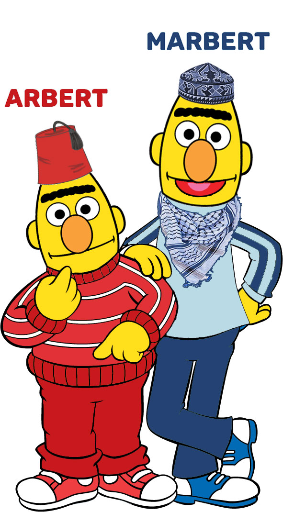

# ARBERT & MARBERT: Deep Bidirectional Transformers for Arabic


**ARBERT** is a large scale pre-training masked language model focused on Modern Standard Arabic(MSA). To train ARBERT, we use the same architecture as BERT-base: 12 attention layers, each has 12 attention heads and 768 hidden dimensions, avocabulary of 100K WordPieces, making ∼163M parameters. We  train  ARBERT on a collection of Arabic datasets comprising 61GB of text (6.2 B tokens)

**MARBERT** is a large scale pre-training masked language model focused on Dialectal Arabic (DA) and Modern Standard Arabic(MSA). Arabic has multiple varieties. To train MARBERT, we randomly sample 1B Arabic tweets from a large in-house dataset of about 6B tweets. We only include tweets with at least 3 Arabic words, based on character string matching, regardless whether the tweet has non-Arabic stringor not.  That is, we do not remove non-Arabic solong as the tweet meets the 3 Arabic word criterion. The dataset makes up 128GB of text (15.6B tokens). We use the same network architecture as ARBERT (BERT-base), but without the next sentenceprediction (NSP) objective since tweets are short. NSP were also shown not to be crucial for model performance. 

## Table of Contents
- [Training Data & Vocabulary](##1-Training-Dat-and-Vovocabulary)
- [ArBench](##2-ArBench)
- Models Evaluation
  - [Sentiment Analysis](##31-Sentiment-Analysis)
  - [Social Meaning](##32-Social-Meaning)
  - [Topic Classification](##33-Topic-Classification)
  - [Dialect Identification](##34-Dialect-Identification)
  - [Named Entity Recogntion (NER)](##35-Named-Entity-Recogntion)
- [Fine-tuning ARBERT and MARBERT](#Fine-tuning-ARBERT-and-MARBERT)

## 1 Training Data and Vocabulary

We compare with ARBERT with mBERT, XLM-R, AraBERT, and MARBERT in terms of data sources and size, vocabulary size, and model parameter size.

|             | **Data Source**              | **#Tokens(ar/all)** | **Tokanization**  | **Vocab Size(ar/all)** | **Cased** | **Arch.**         | **#Param** |
|---------|---------------------|----------------|---------------|--------------|-------|---------------|--------|
| mBERT   | Wikipedia           | 153M/1.5B      | WordPiece     | 5K/110K      | yes   | base          | 110M   |
| XLM-R<sub>B</sub> | CommonCraw          | l2.9B/295B     | SentencePiece | 14K/250K     | yes   | base          | 270M   |
| XLM-R<sub>L</sub>  | CommonCraw          | l2.9B/295B     | SentencePiece | 14K/250K     | yes   | large         | 550M   |
| AraBERT | Several (3 sources) | 2.5B/2.5B      | SentencePiece | 60K/64K      | no    | base          | 135M   |
| **ARBERT**  | Several (6 sources) | 6.2B/6.2B      | WordPiece     | 100K/100K    | no    | base          | 163M   |
| **MARBERT** | Arabic Twitter      | 15.6B/15.6B    | WordPiece     | 100K/100K    | no    | base          | 163M   |

## 2 ArBench
To  evaluate  our  models,   we  propose  **ArBench**,   a new benchmark for multi-dialectal Arabic language understanding.  ***ArBench is built using 41 datasets targeting 5 different tasks/task clusters***, allowing us to offer a series of standardized experiments under rich conditions.

|**Data Type** | **Data  (#classes)**                    | **TRAIN**   | **DEV**    | **TEST**   |
|-------------------|-------------------------------------|---------|--------|--------|
|Sentiment Analysis | AJGT (2)                            |   1,441 | -      |    361 |
|                   | AraNET<sub>Sent</sub> (2)      | 100,592 | 14,331 | 11,819 |
|                   | AraSenTi (3)          |  11,117 |  1,407 |  1,382 |
|                   | ArSarcasm<sub>Sent</sub> (3)   |   8,438 | -      |  2,111 |
|                   | ArSAS (3)                           |  24,773 | -      |  3,692 |
|                   | ArsenTD-LEV (5)                     |   3,201 | -      |    801 |
|                   | ASTD (3)                            |  24,773 | -      |    664 |
|                   | ASTD-B(2)                           |   1,065 | --     |    267 |
|                   | AWATIF(4)                           |   2,284 |    288 |    284 |
|                   | BBN(3)                              |     960 |    125 |    116 |
|                   | HARD (2)                            |  84,517 | -      | 21,130 |
|                   | LABR (2)                            |  13,161 |        |  3,288 |
|                   | SAMAR(5)                            |   2,491 |    310 |    316 |
|                   | SemEval (3)                         |  24,773 | -      |  6,101 |
|                   | SYTS(3)                             |     960 |    202 |    199 |
|                   | Twitter<sub>Saad</sub> (2) |   1,569 |    202 |    190 |
|                   | Twitter<sub>Abdullah</sub> (2)     |  46,999 |  5,779 |  5,824 |
|Social Meaning| Arab_Tweet - Age (3)     | 1285796 | 160725 | 160726 |
|                   | Arab_Tweet - Gender (2)   | 1285796 | 160725 | 160726 |
|                   | AraNET<sub>Emo</sub> - Emotion (8)   |  189903 |    911 |    942 |
|                   | AraSarcasm  - Sarcasm (2)   |   8,438 | -      |  2,111 |
|                   | Dangerous(2)  |    3475 |    616 |    664 |
|                   | FIRE2019 - Irony (2)    |    3622 | -      |    404 |
|                   | OSACT-A - Offensive (2)  |   10000 |   1000 |   2000 |
|                   | OSACT-B - Hate Speech(2) |   10000 |   1000 |   2000 |
|Topic Classification|  OSAC (10)  | 17944 | 2244 | 2244 | 
|                   | Khallej (4) |  4553 |  570 |  570 | 
|                   |  ANT(5)  | 25219 | 3154 | 3153 |  
|Dialect Identification|              AOC (2)              |      Binary     |  86,541 | 10,809 | 10,807 |
|                   |              AOC (3)              |      Region     |  35,679 |  4,464 |  4,455 |
|                   |              AOC (4)              |      Region     |  86,489 | 10,814 | 10,803 |
|                   | ArSarcasm<sub>Dia</sub> (5) |      Regoin     |  8,438  |    -   |  2,111 |
|                   |           MADAR-TL (21)           |     Country     | 193,087 | 26,589 | 43,910 |
|                   |             NADI (21)             |     Country     |  2,100  |  4,957 |  5,000 |
|                   |             NADI (100)             |     Province     |  2,100  |  4,957 |  5,000 |
|                   |             QADI (18)             |     Country     | 497,816 |   --   |  3,504 |


|**Data Type**| **Dataset**| **#Tokens** | **#PER**  | **#LOC**  | **#ORG**  |
|-------------|------------|-------------|-----------|------------|----------|
|Named Entity Recogntion| ANERCorp   | 150K    | 6,504 | 5,018 | 3,437 |
|                   | ACE-2003BN | 15K     | 832   | 1,223 | 288   |
|                   | ACE-2003NW | 27K     | 1,146 | 1,147 | 893   |
|                   | ACE-2004BN | 70K     | 3,201 | 3,921 | 2,239 |
|                   | TW-NER     | 81K     | 1,252 | 1,300 | 765   |


## 3 Models Evaluation
When fine-tuned on ArBench,  ARBERT and MARBERT collectively achieve new SOTA  with sizeable margins compared to all existing models such as mBERT, XLM-R (Base and Large), and  AraBERT on 37 out of 45 classification tasks on the 41 datasets (82.22%). 

### 3.1 Sentiment Analysis

| **Dataset (#classes)** |  **mBERT** | **XLM-R<sub>B</sub>** | **XLM-R<sub>L</sub>** | **AraBERT** | **ARBERT** | **MARBERT** |
|--------------------|:------:|:----------:|:-----------:|:-------:|:------:|:-------:|
| AJGT (2)           | 86.67 |   89.44   |    91.94   |  92.22 | 94.44 |  **96.11** |
| HARD (2)           |95.54 |   95.74   |    95.96   |  95.89 | 96.12 |  **96.17** |
| ArsenTD-LEV (5)    | 50.50 |   55.25   |    **62.00**  |  56.13 | 61.38 |  60.38 |
| LABR (2)           | 91.20 |   91.23   |    92.20   |  91.97 | 92.51 |  **92.49** |
| ASTD-B(2)          |  79.32 |   87.59   |    77.44   |  83.08 | 93.23 |  **96.24** |

***Results reported based on Acc. score***

| **Dataset (#classes)** |  **mBERT** | **XLM-R<sub>B</sub>** | **XLM-R<sub>L</sub>** | **AraBERT** | **ARBERT** | **MARBERT** |
|--------------------|:------:|:----------:|:-----------:|:-------:|:------:|:-------:|
| ArSAS (3)           | 87.50 | 90.00 | 91.50 | 91.00 | 92.00 | **93.00**|
| ASTD (3)            | 67.00 | 60.67 | 67.67 | 72.00 | 76.50 | **78.00** |
| SemEval (3)          | 57.00 | 64.00 | 67.00 | 62.00 | 69.00 | **71.00** |
| AraNET<sub>Sent</sub> (2)       | 84.00 | 92.00 | 93.00 | 86.50 | 89.00 | **92.00** |
| ArSarcasm<sub>Sent</sub> (3)      | 60.50 | 63.50 | 70.00 | 63.50 | 68.00 | **71.50** |
| AraSenTi (noura) (3) | 89.50 | **92.00** | 93.50 | 91.00 | 90.00 | 90.00 |
| BBN(3)                     | 55.50 | 69.50 | 46.50 | 70.00 | 76.50 | **79.00** |
| SYTS(3)                    | 67.00 | 78.00 | 40.50 | 75.50 | **79.00** | 76.50 |
| Twitter<sub>Saad</sub> (2)               | 79.00 | 95.00 | 95.00 | 81.00 | 90.00 | **96.00** |
| SAMAR(5)                   | 22.50 | 54.00 | **57.00** | 36.50 | 43.50 | 55.50 |
| AWATIF(4)                  | 60.50 | 63.50 | 68.50 | 66.50 | 71.50 | **72.50** |
| Twitter<sub>Abdullah</sub> (2)           | 81.50 | 91.00 | 92.00 | 89.50 | 91.50 | **95.00** |

***Results reported based on F<sub>1</sub><sup>NP</sup> score.***
### 3.2 Social Meaning
| **Task (#classes)**        |   **Dataset**  |  **mBERT** | **XLM-R<sub>B</sub>** | **XLM-R<sub>L</sub>** | **AraBERT** | **ARBERT** | **MARBERT** |
|----------------|---------------------|:------:|:----------:|:-----------:|:-------:|:------:|:-------:|
| Offensive (2)  | OSACT-A | 84.25 |   85.26  |    88.28  |  86.57 | 90.38 |  **92.41** |
| Hate Speech(2) | OSACT-B | 72.81 |   71.33  |    79.31   |  78.89 | 83.02 |  **84.79**|
| Dangerous (2)  |       Dangerous       | 62.66 |   62.76  |    65.01 |  64.37 | 63.21 |  **67.53** |
| Sarcasm (2)    |       AraSarcasm      | 68.20 |   66.76  |    69.23  |  72.23 | 75.04 |  **76.30** |
| Emotion (8)    |       AraNET<sub>Emo</sub>     | 65.79 |   70.67   |    74.89   |  65.68 | 67.73 |  **75.83** |
| Irony (2)      |     FIRE2019     | 80.96 |   81.97  |    82.52%  |  83.01 | 85.59 |  **85.33** |
| Age (3)        |       Arab_Tweet      | 56.35 |   59.73   |    53.60   |  57.72 | 58.95 |  **62.27** |
| Gender (2)     |       Arab_Tweet      | 68.06|   71.00   |    71.14   |  67.75 | 69.86 |  **72.62** |

***Results reported based on F<sub>1</sub> score.***

### 3.3 Topic Classification
| **Dataset (#classes)**  |  **mBERT** | **XLM-R<sub>B</sub>** | **XLM-R<sub>L</sub>** | **AraBERT** | **ARBERT** | **MARBERT** |
|----------------|:------:|:----------:|:-----------:|:-------:|:------:|:-------:|
| OSAC (10)                    | 96.84 | 97.15 | 98.20 | 97.03 | **97.50** | 97.23 |
| Khallej (4)                  | 92.81 | 91.87 | 93.56 | 93.83 | **94.53** | 93.63 |
| ANT<sub>Text</sub> (5)       | 84.89 | 85.77 | 86.72 | **88.17** | 86.87 | 85.27 |
| ANT<sub>Title</sub> (5)      | 78.29 | 79.96 | 81.25 | 81.03 | **81.70** | 81.19 |
| ANT<sub>Text+Title</sub> (5) | 84.67 | 86.21 | 86.96 | **87.22** | 87.21 | 85.60 |

***Results reported based on F<sub>1</sub> score.***
### 3.4 Dialect Identification
| **Task  (#classes)**        |   **Dataset**  |  **mBERT** | **XLM-R<sub>B</sub>** | **XLM-R<sub>L</sub>** | **AraBERT** | **ARBERT** | **MARBERT** |
|----------------|---------------------|:------:|:----------:|:-----------:|:-------:|:------:|:-------:|
| Regoin (5)      | ArSarcasm<sub>Dia</sub> | 43.81 | 41.71 | 41.83 | 47.54 |  51.27 | **54.70**|
| Country (21)    |  MADAR-TL | 34.92 | 35.91 | 35.14 | 34.87 | 37.90 |**40.40** |
| Region (4)      |       AOC      | 77.27 | 77.34 | 78.77 | 79.20 | 81.09 | **82.37**|
| Region (3)      |       AOC      | 85.76 | 86.39 | 87.56 | 87.68 | 89.06 | **90.85** |
| Binary (4)            |       AOC      | 86.19 | 86.85 | 87.30 | 87.76 | 88.46 | **88.59** |
| Country(18)     |      QADI      | 66.57 | 77.00 | 82.73 | 72.23 | 88.63 | **90.89** |
| Country(21)     |      NADI      | 13.32 | 16.36 | 17.17 | 17.46 | 22.56 | **29.14** |
| Province (100 ) |      NADI      |  2.13 |  4.12 |  0.32 |  3.13 |  6.10 |  **6.28** |

***Results reported based on F<sub>1</sub> score.***

### 3.5 Named Entity Recogntion
| **Dataset**  |  **mBERT** | **XLM-R<sub>B</sub>** | **XLM-R<sub>L</sub>** | **AraBERT** | **ARBERT** | **MARBERT** |
|----------------|:------:|:----------:|:-----------:|:-------:|:------:|:-------:|
| ANERcorp.   | 86.78 | 87.24 | **89.94** | 89.13 | 84.38 | 80.64 |
| ACE 2004 NW | 86.37 | **89.93** | 89.89 | 89.03 | 88.24 | 85.02 |
| ACE 2003BN  | 91.23 | 53.97 | 85.41 | 91.94 | **96.18** | 79.05 |
| ACE 2003NW  | 81.40| 87.24 | 90.62 | 88.09 | **90.09** | 87.76 |
| TW-NER     | 36.83 | 49.16 | 54.44 | 41.26 | 59.17 | **67.39** |

***Results reported based on F<sub>1</sub> score.***

## Fine-tuning ARBERT and MARBERT
 
 ```python
    import 
 ```
 
## Citation
If you use our models (ARBERT or MARBERT) for your scientific publication, or if you find the resources in this repository useful, please cite one of the following paper:
```
citiation
```

## Acknowledgements
Gratefully   acknowledges   support   fromthe   Natural   Sciences   and   Engineering   Research  Council  of  Canada,  the  Social  Sciencesand  Humanities  Research  Council  of  Canada,Canadian  Foundation  for  Innovation,  [ComputeCanada](www.computecanada.ca) and [UBC ARC-Sockeye](https://doi.org/10.14288/SOCKEYE). We  also  thank  the  [Google TensorFlow Research Cloud (TFRC)](https://www.tensorflow.org/tfrc) program for providing us with free TPU access.
